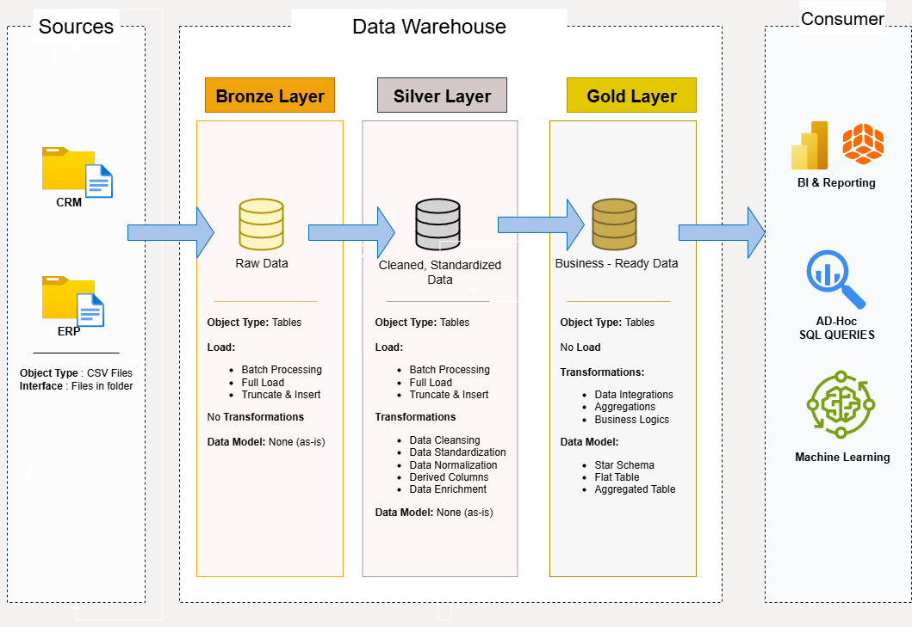

 # Data Warehouse and Analytics Project

**Welcome to the repository for the Data Warehouse and Analytics Project ! 🚀**

This project showcases an end-to-end data warehousing and analytics solution,covering everything from warehouse development to generating meaningful business insights. It’s designed to reflect industry-standard practices in both data engineering and analytics. 

---
## 🏗️ Data Architecture

The data architecture for this project follows Medallion Architecture **Bronze**, **Silver**, and **Gold** layers:

1. **Bronze Layer**: Stores raw data as-is from the source systems. Data is ingested from CSV Files into SQL Server Database.
2. **Silver Layer**: This layer includes data cleansing, standardization, and normalization processes to prepare data for analysis.
3. **Gold Layer**: Houses business-ready data modeled into a star schema required for reporting and analytics.

---
